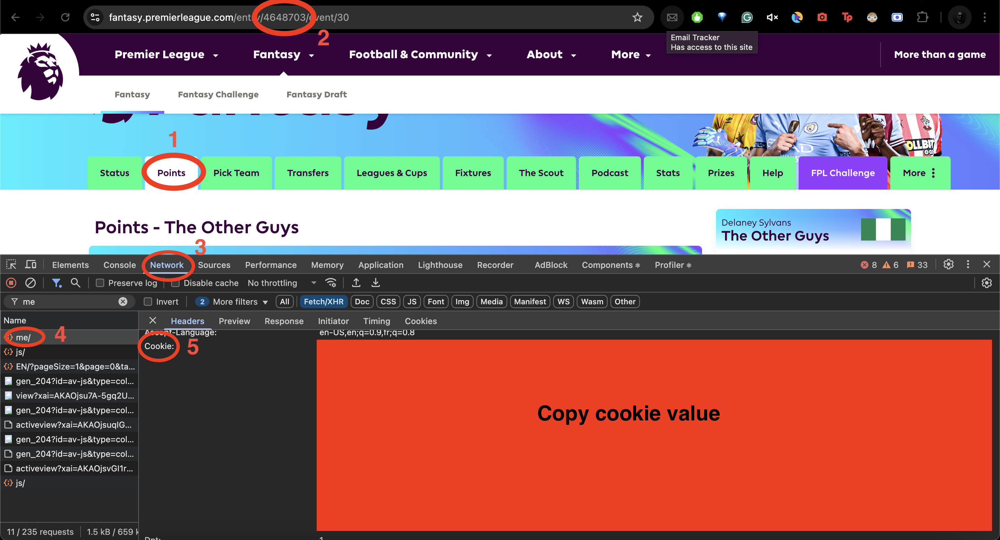

# Fantasy Premier League AI Transfer Advisor

A smart AI agent that analyzes your Fantasy Premier League (FPL) team and recommends optimal player transfers — fully compliant with FPL rules and powered by **Amazon Bedrock**, **TypeScript**, and **Retrieval-Augmented Generation (RAG)** techniques.

> ⚽️ Stop guessing transfers. Let AI do the thinking.

---

## Features

- 🔍 Analyses your current FPL team
- 📊 Evaluates player performance based on stats
- 💰 Recommends **free** transfers within your budget
- 🚫 Avoids penalties and respects game rules (budget, squad limits, max 3 players per club)
- 🧠 Uses Amazon Bedrock (LLM) to add contextual intelligence to decisions

---

## 🔧 Tech Stack

- **TypeScript**
- **Node.js**
- **Amazon Bedrock** (for AI integration)
- **FPL API** (undocumented but publicly accessible)

---

## 🚀 Getting Started

### 1. Clone the Repo

```bash
git clone https://github.com/delaney/fpl-transfer-advisor.git
cd fpl-transfer-advisor
```

### 2. Install Dependencies and create .env file
```bash
npm install
cp .env.example .env
```

### 3. Add Your Config
```bash
AWS_ACCESS_KEY_ID=your_key
AWS_SECRET_ACCESS_KEY=your_secret
AWS_REGION=your_region
AWS_LLM_ID=ID of Amazon Bedrock LLM model you selected

# If you choose to include an agent
AWS_KNOWLEDGE_ID=your_knowledge_base_id
AWS_AGENT_ID=your_agent_id
AWS_AGENT_ALIAS_ID=your_agent_alias_id
```

### 4. Run the App
```bash
npm run start
```
---

## ⚙️ Usage
```ts
const teamId = '1234567'; // Your FPL team ID
const transfers = 4; // Number of transfers to recommend

const results = await analyseTeam(teamId, transfers);
console.log(results);
// [
//     { out: 'Harwood-Bellis', in: 'Bednarek', cost: 0 },
//     { out: 'Davis', in: 'Mazraoui', cost: -1 },
//     { out: 'Pedro Porro', in: 'Muñoz', cost: -1 },
//     { out: 'Mitoma', in: 'Rogers', cost: -10 }
// ]
```
You can also call the AWS Bedrock-powered AI agent to enhance suggestions:
```ts
// Direct LLM query
const aiRecommendations = await getFPLAdvice(teamId, transfers);
res.json({ aiRecommendations });
// {
//     "recommendations": "Out: Mitoma\nIn: Elanga\nCost: -£1.0 Out: Semenyo\nIn: Bruno Fernandes\nCost: £2.9 Out: Palmer\nIn: Bruno Fernandes\nCost: -£2.1 Out: I.Sarr\nIn: Elanga\nCost: -£0.2"
// }

// Use RAG 
const agentRecommendations = await getFPLAgentAdvice(teamId, transfers);
res.json({ aiRecommendations });
```
---

## How to Get Your Team ID
>This is required to access your actual team data via the FPL /api/my-team/{teamId} endpoint.

- Log in to fantasy.premierleague.com
- Click on the Points tab<sup>1</sup> on the FPL site, and copy the team ID from the URL<sup>2</sup>



---

## 🗓️ Roadmap
- Automatically fetch & use Team ID and Cookie from user credentials

- Support multiple gameweek planning

- Improve LLM reasoning with structured prompts

- Add agent to get best recommendation options

---

## Feedback & Contributions
Pull requests and issue reports are welcome!
If you’ve got an idea to improve the agent or want to collaborate, feel free to open a discussion or contact me 😀.

